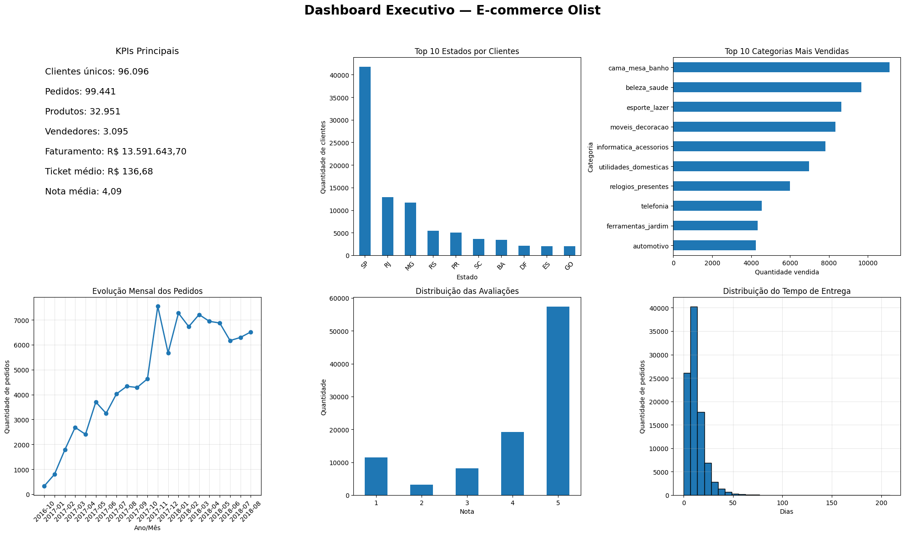
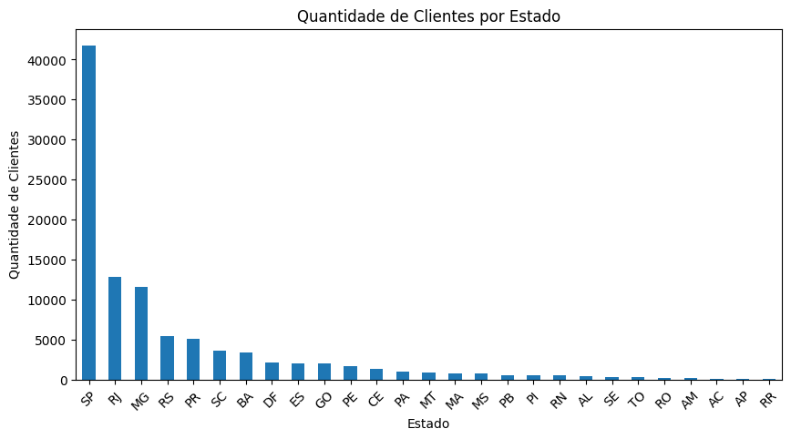
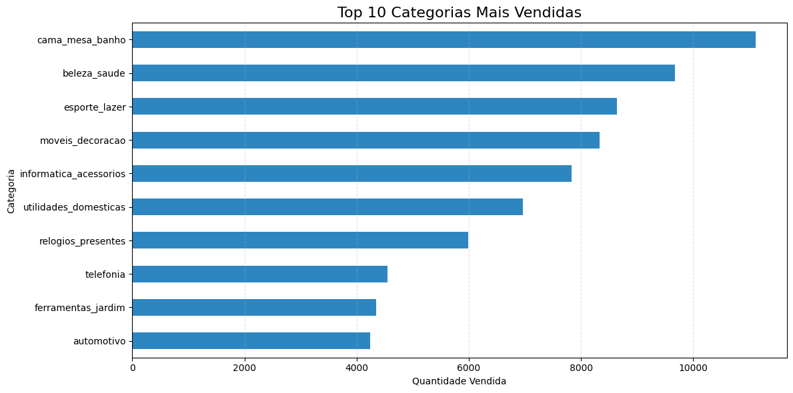
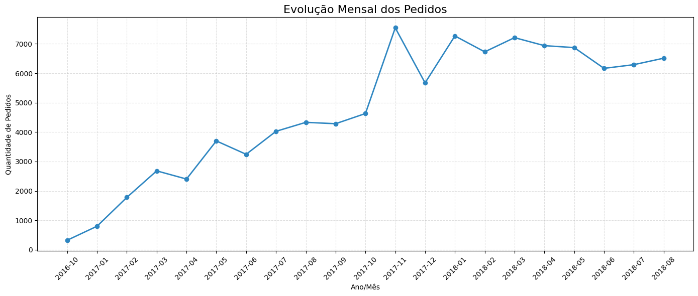
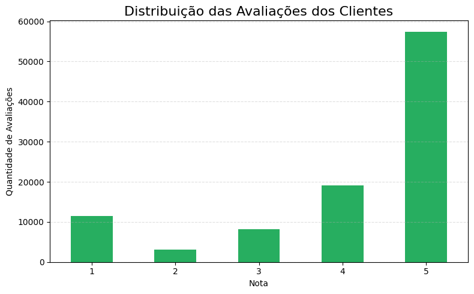
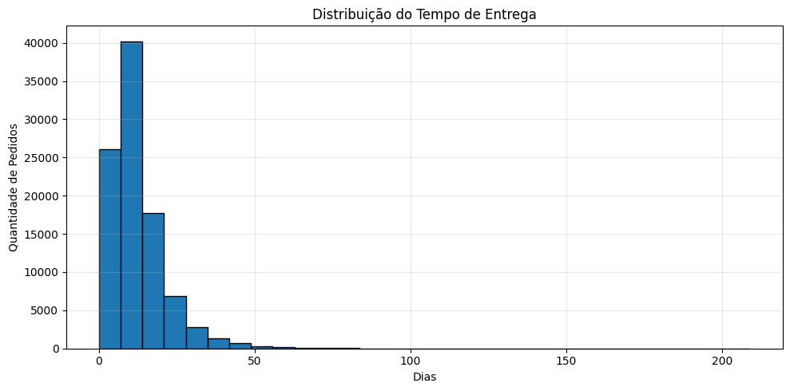

# 📊 Análise Exploratória de Dados — E-commerce Olist

> Case Técnico desenvolvido para o processo seletivo da **Dadosfera**.

---

# 📖 Sobre o Projeto

Este projeto apresenta uma Análise Exploratória de Dados (EDA) utilizando a base pública do **Olist**, um marketplace brasileiro.

O objetivo foi explorar os dados de clientes, pedidos, produtos, vendedores, pagamentos e avaliações para gerar indicadores de negócio (KPIs), identificar padrões de comportamento dos consumidores e construir um dashboard executivo para apoiar a tomada de decisão.

---

# 🎯 Objetivos

- Explorar e compreender a estrutura dos dados;
- Realizar tratamento e limpeza das informações;
- Construir indicadores de negócio (KPIs);
- Identificar padrões de vendas;
- Analisar clientes e categorias;
- Avaliar a satisfação dos consumidores;
- Criar um Dashboard Executivo utilizando Python.

---

# 🛠️ Tecnologias Utilizadas

- Python
- Pandas
- NumPy
- Matplotlib
- Seaborn
- Google Colab
- Git
- GitHub

---

# 📁 Estrutura do Projeto

```text
📂 dashboard
📂 data
📂 docs
📂 images
📂 notebooks
📂 presentation
📂 sql
📂 streamlit
README.md
```

---

# 📊 Indicadores de Negócio (KPIs)

Durante a análise foram calculados diversos indicadores:

| Indicador | Resultado |
|-----------|----------:|
| Clientes únicos | 96.096 |
| Pedidos | 99.441 |
| Produtos | 32.951 |
| Vendedores | 3.095 |
| Categorias | 71 |
| Faturamento Total | R$ 13.591.643,70 |
| Ticket Médio | R$ 136,68 |
| Nota Média | 4,09 |

---

# 📈 Principais Análises

Foram realizadas análises sobre:

- Distribuição dos clientes por estado;
- Top 10 categorias mais vendidas;
- Evolução mensal dos pedidos;
- Distribuição das avaliações dos clientes;
- Distribuição do tempo de entrega;
- Construção de KPIs executivos;
- Desenvolvimento de Dashboard Executivo.

---

# 💡 Principais Insights

### 📍 Clientes

São Paulo concentra a maior quantidade de clientes da plataforma, seguido por Rio de Janeiro e Minas Gerais.

---

### 🛒 Categorias

As categorias relacionadas à casa, decoração e beleza lideram as vendas.

---

### ⭐ Avaliações

A maior parte das avaliações possui nota **5**, indicando alto nível de satisfação dos clientes.

---

### 🚚 Entregas

Grande parte das entregas ocorre entre **7 e 20 dias**, indicando boa eficiência logística.

---

### 📈 Evolução dos Pedidos

Foi observado crescimento consistente do volume de pedidos ao longo do período analisado.

---

## 📊 Dashboard Executivo

O projeto culminou na construção do dashboard abaixo:



---

## 📈 Principais Visualizações

### 👥 Clientes por Estado



### 🛒 Top 10 Categorias Mais Vendidas



### 📅 Evolução Mensal dos Pedidos



### ⭐ Distribuição das Avaliações



### 🚚 Distribuição do Tempo de Entrega




---

# 🚀 Possíveis Melhorias

- Dashboard interativo com Streamlit;
- Integração com SQL;
- Atualização automática dos dados;
- Filtros dinâmicos;
- Publicação em ambiente web.

---

---

# ▶️ Executando o Data App

O projeto inclui um Data App desenvolvido com **Streamlit**, localizado na pasta `streamlit`.

### Instalação das dependências

```bash
cd streamlit
pip install -r requirements.txt
```

### Execução

```bash
streamlit run app.py
```

O aplicativo apresenta os principais indicadores, dashboard executivo e visualizações desenvolvidas durante a análise exploratória de dados.

---

# 👩‍💻 Autora

**Laryssa Leão de Carvalho Tomé**

Estudante da UEMG

Projeto desenvolvido para fins acadêmicos e para o processo seletivo da Dadosfera.

---

# ⭐ Contato

GitHub:

https://github.com/laryssaleaocarvalhotome-ui
